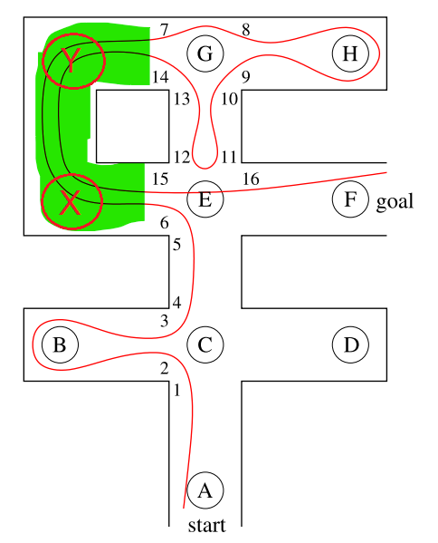

# This algorithm solves the Labyrinth introduced in the book using Depth first searching.

- the labyrinth introduced in the book with junctions acting as the nodes as shown in the image. however, the green highlighted path had no junction (node) so i had no idea how to navigate through it or even detect that it has a right switch, so i created 2 nodes (x, y) just to anchor the path/switch.

- tried to initialize the nodes along with their neighbours on initialization but had an error because the neighbour variables weren't created just yet.   e.g:  
node_a = ('A',[node_b]) -> this would give an error because variable node_b isn't initialized just yet. 
node_b = ('B',[node_a]).

  so i had to initialize all of the variables first, then added their neighbours    e.g:  
  node_a = ('A') 
  node_b = ('B') 
  node_a.add_neighbor(node_b) 
  node_b.add_neighbor(node_a) 

- had a trouble understanding/implementing the literal logic of the iterative depth first algorithm explained in the book so i had to implement my own logic using the same data structure used in the book (stack)