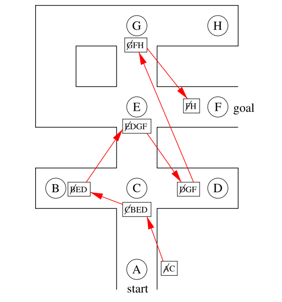

# This algorithm solves the Labyrinth introduced in the book using Breadth first searching.

- the solution is displayed in the image above.    this algorithm is very similar to depth-first-search, had no issue implementing it, just changed the stack into a queue. also removed the x,y nodes i created them there as i didn't need them here.