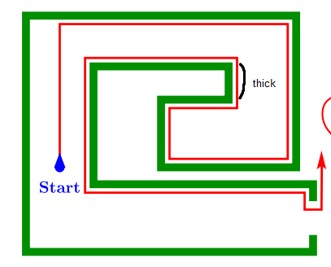
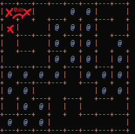

### this is the pledge algorithm from chapter 8, it aims to solve mazes, trying to break out of them.
- the code creates a new maze each time you run it and prints the solution. passed nodes are marked with an '@' symbol.
- the algorithm i implemented is found in the pledge_solve method.

- found and used this cool repo helped me create mazes https://github.com/sethm/ruby_maze, however, i had to tweak it a little bit to serve my needs.
- the original maze file contained a solve method, so i replaced it with my algorithm implementation

- something else was that it created new mazes each time i ran the code so i got confused while debugging.
So i serialized, then saved a randomly generated maze in the file called maze.dump through yaml to continue my debugging into it to not get confused.

- i ran through trouble implementing this algorithm since i didn't find a suitable maze generator
- the maze generator i want would be able to generate maze with "thick" walls, that means that the wall has a 2d shape, so that i can keep moving and keeping the wall always by my side whenever i take a turn. but with walls that are just single lines, i couldn't follow the obstacle's wall as intended by the algorithm. the below pictures illustrates what i mean

- but then i thought about following the opened neighbor nodes, rather than the side blocked nodes which was supposed to act as walls
