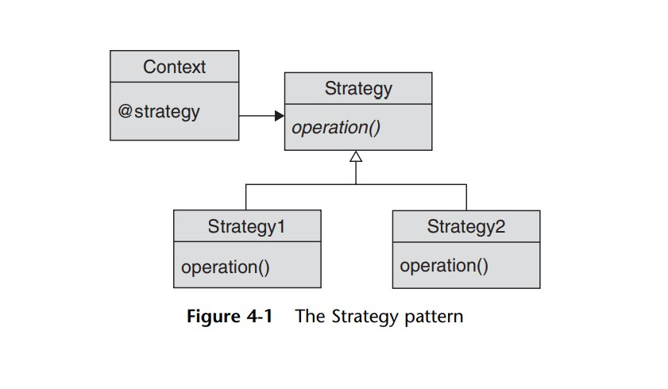

# Strategy Pattern: 

Followin up from the previous template pattern, we need to isolate the whole algorithm (behavior) part into its own class to achieve the following:  
  - less inheritance as it is not favored (your subclasses are tangled up with your class).  
  - increase runtime flexibility. That is, being able to switch behavior at runtime within the same object.

We could achieve that through delegation:  
by creating a family of classes each of which implements an algorithm variation. 
The user (context class) can refer to whatever strategy class it wants to use its behavior.

 
 

  

 

## thoughts:

- It was very interesting knowing how we could simplify our strategy pattern into simple procs instead of classes.

- Getting introduced to strategy pattern first in java, I wondered how would we force an interface in ruby.  
  An interface is just a class with no implementation at all.  
  However, due to the strong type nature of java/C#, using it provided us a safeguard against methods mismatch.

  But, given the dynamic nature of ruby, I wondered if we needed it at all.  
  Now knowing that ruby prefers to not use these "do nothing abstract" classes, wouldn't it propose a risk of subclasses not following the same interface?  

  with strong typed languages as java/C#, we had to implement the right set of methods from our interface into our subclass or else the program wouldn't compile.  
  Now we have to pay attention to get it right ourselves. as dangerous as it seems, I think we could come around that through unit tests, acting as our compiler.