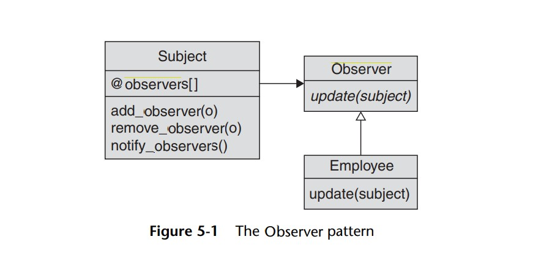

# Observer Pattern: 

The observer pattern aims to solve a problem where you have a class_X that needs to be aware of some state in class_Y, and you don't want class_X to keep (Polling) asking class_Y every second/minute if its state has changed.  
So instead, you make class_Y whenever being changed, notify class_X that it has changed.  

Class_X here is called an observer (observing changes), while class_Y is the subject (that has changes going on).  

the subject doesn't necessarily need to have a single observer, it could have multiple observers at once. However, it needs to keep track of them.  
That's why the subject class keeps a list of the observers that needs to know whenever a change occur.  

 
 

  

 

## Thoughts:

- I wondered about how we could be more specific (providing changes data) when notifying the observers about the changes that occured.  
  I thought we could create multiple "update" methods, each stands and holds data for a specific change.  
  It was good to know that such thing exists after reading a little more (push method).  
  
- about the disadvantage of the push method, not all observers are interested in such extra data being passed to them.
  It makes me wonder, shouldn't we try to separate the observers by interest?  
  
  eg; Coudln't we store the observers in a hash where the key is the state, the value is the list of observers interested in such a state?  
      This way we would come around that disadvantage by calling the update method (with passing data) to the only interested observers.  
      Although this would require observers to specify which state they're interesting in when they register as an observer for the subject.  