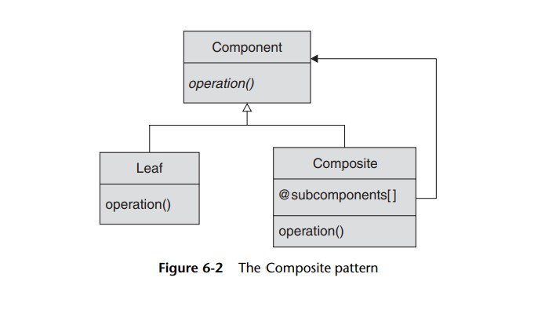

# Composite Pattern: 

The composite design pattern is a structural pattern used to represent objects that have a hierarchical tree structure.  
It allows for the uniform treatment of both individual leaf nodes and of branches composed of many nodes.

 
 

  

 